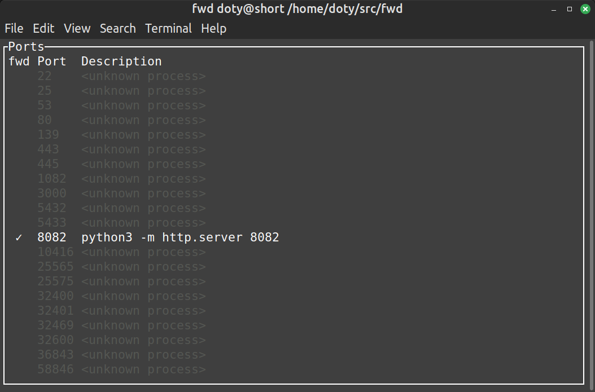

# fwd

A port-forwarding utility.

Here's how it works:
1. Get the latest [release](https://github.com/DeCarabas/fwd/releases) of `fwd`
2. You install `fwd` on the server somewhere in your `$PATH` (like `/usr/bin/`, or `.local/bin`)
3. You install `fwd` on the client (like your laptop)
4. You run `fwd` on the client to connect to the server, like so:

```bash
doty@my.laptop$ fwd some.server
```

`fwd` will connect to `some.server` via ssh, and then show you a screen listing all of the ports that the server is listening on locally.



Use the up and down arrow keys (or `j`/`k`) to select the port you're interested in and press `e` to toggle forwarding of that port.
Now, connections to that port locally will be forwarded to the remote server.

If the port is something that might be interesting to a web browser, you can press `<ENTER>` with the port selected to open a browser pointed at that port.

If something is going wrong, pressing `l` will toggle logs that might explain it.

Press `q` to quit.
